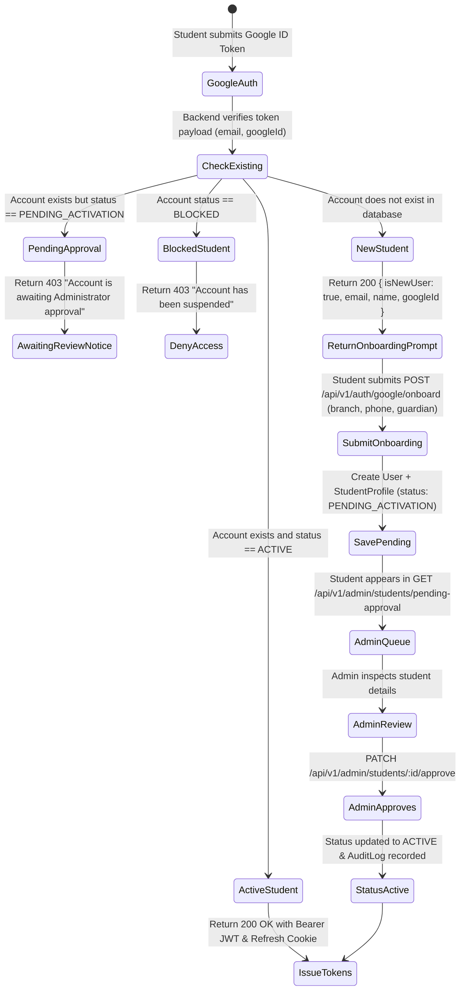

# Coaching Center Management System — Backend Project Plan

> **Version**: 2.0.0 (Enterprise Specification)  
> **Status**: Approved Foundation  
> **API Standard**: RESTful v1 with Postman Collection & 20+ Core Endpoints

---

## 1. Project Mission & Overview

Build a production-grade, secure, multi-branch backend for a **Coaching Center Management System**. The platform centralizes daily operational and academic workflows: organization/branch governance, student and teacher lifecycle management, course and batch scheduling, attendance, examinations, automated fee collection via **Stripe**, and activity audit logging.

The system enforces strict role-based and branch-scoped access control, robust data integrity with Prisma transactions, universal soft deletes, and structured error handling.

---

## 2. Core Project Rules & Architectural Pillars

1. **Four Primary Roles & Delegated Permissions**:
    - `SUPER_ADMIN`: Organization-wide governance, branch provisioning, admin management, global audit logs, and high-level revenue analytics.
    - `ADMIN`: Assigned branch management, course/batch creation, student/teacher accounts, attendance supervision, exam grading publication, and fee tracking.
    - `TEACHER`: Assigned classes/batches, taking and viewing attendance, entering exam marks, and viewing assigned routines. (May also hold explicit delegated operational permissions granted by an Admin).
    - `STUDENT`: Self-service portal: viewing assigned classes/routines, checking attendance, viewing published exam marks, and paying batch fees securely online via Stripe.
2. **Mandatory Real Payment Integration (Stripe)**:
    - Direct integration with **Stripe** (Checkout Sessions and Payment Intents).
    - Cryptographically verified Stripe webhook (`/api/v1/payments/webhook`) handling lifecycle events (`checkout.session.completed`, `payment_intent.payment_failed`).
    - Immutable transaction ledger and payment receipts; zero manual or fake status tampering.
3. **Authentication & Identity**:
    - Custom credential authentication (Email/Password with bcrypt hashing, short-lived JWT Access Tokens, and rotating HttpOnly Refresh Tokens).
    - **Google Social Login (OAuth 2.0 via GCP)** incorporated into the authentication architecture.
4. **Security & API Protection**:
    - API Rate Limiting with `express-rate-limit` to prevent brute-force attacks and abuse.
    - Secure HTTP headers via `helmet` and strict `cors` origin configuration.
5. **Advanced Data Practices & Concurrency Control**:
    - **Concurrency-Safe Transactions**: Interactive `prisma.$transaction` for batch enrollment seat quotas to prevent race conditions and over-enrollment.
    - **Universal Soft Deletes**: Deletion operations preserve records by updating a `deletedAt` timestamp.
    - **Audit Trail**: High-value mutations (role alterations, payments, attendance corrections) emit immutable `AuditLog` records.
6. **Documentation**:
    - Documented and tested via a comprehensive **Postman Collection (v2.1)** with environment variables, automated authorization headers, and assertions.

---

## 3. Technology Stack

| Category                 | Technology                                      | Purpose & Implementation Details                                                                                                  |
| :----------------------- | :---------------------------------------------- | :-------------------------------------------------------------------------------------------------------------------------------- |
| **Runtime & Language**   | Node.js (v24+) + TypeScript (v7+)               | High-performance server runtime with strict type safety and ES module resolution (`bundler`).                                     |
| **Framework**            | Express.js (v5)                                 | HTTP pipeline, security middleware, and modular domain routing.                                                                   |
| **Database & ORM**       | PostgreSQL + Prisma (v7+)                       | Relational database with driver adapter (`@prisma/adapter-pg` + `pg.Pool`), modular multi-file schema folder (`prisma/*.prisma`). |
| **Validation**           | Zod (v4+)                                       | Runtime schema validation and data sanitization for request body, query, params, and env.                                         |
| **Payments**             | Stripe                                          | Real card payment processing, hosted checkout sessions, and webhook event verification.                                           |
| **Auth & Security**      | JWT, bcryptjs, express-rate-limit, helmet, cors | Access/refresh token lifecycle, password hashing, and endpoint rate limiting.                                                     |
| **Social Login**         | Google OAuth 2.0 (GCP)                          | Identity verification and single sign-on for students and staff.                                                                  |
| **Linting & Formatting** | Biome (v2.5+)                                   | Enterprise-grade linting, formatting, and import organization (`biome.json`).                                                     |
| **File Storage**         | Cloudinary (abstracted)                         | Avatar and document asset storage behind `StorageService` interface.                                                              |
| **Documentation**        | Postman Collection (v2.1)                       | Interactive request definitions, environment configuration, and test assertions.                                                  |

---

## 4. Minimum 20+ API Endpoints Specification

All endpoints are versioned under `/api/v1` and follow standardized response envelopes.

### 4.1 Authentication & Identity (6 APIs)

| Method | Endpoint                      | Access        | Description                                                                         |
| :----- | :---------------------------- | :------------ | :---------------------------------------------------------------------------------- |
| `POST` | `/api/v1/auth/register`       | Public        | Standard email/password student registration (creates profile)                      |
| `POST` | `/api/v1/auth/login`          | Public        | Email/Password login, returns Bearer JWT + Refresh Cookie                           |
| `POST` | `/api/v1/auth/google`         | Public        | Google ID Token verification; returns JWT if active student, or triggers onboarding |
| `POST` | `/api/v1/auth/google/onboard` | Public        | Submits student onboarding details; creates account in `PENDING_ACTIVATION` state   |
| `POST` | `/api/v1/auth/refresh-token`  | Public        | Rotates refresh token and issues fresh access token                                 |
| `POST` | `/api/v1/auth/logout`         | Authenticated | Revokes session and clears authentication cookies                                   |

### 4.2 User & Profile Management (4 APIs)

| Method  | Endpoint                        | Access              | Description                                                |
| :------ | :------------------------------ | :------------------ | :--------------------------------------------------------- |
| `GET`   | `/api/v1/users/me`              | Authenticated       | Retrieves current logged-in user profile, role, and branch |
| `PATCH` | `/api/v1/users/me`              | Authenticated       | Updates personal profile information                       |
| `PATCH` | `/api/v1/users/change-password` | Authenticated       | Verifies old password and updates account credentials      |
| `GET`   | `/api/v1/users/:id`             | Admin / Super Admin | Retrieves detailed user account and permission profile     |

### 4.3 Branch Governance (Multi-Branch) (5 APIs)

| Method   | Endpoint                | Access              | Description                                                          |
| :------- | :---------------------- | :------------------ | :------------------------------------------------------------------- |
| `POST`   | `/api/v1/branches`      | Super Admin         | Creates a new branch (generates unique `slug` from name)             |
| `GET`    | `/api/v1/branches`      | Authenticated       | Lists all active coaching branches                                   |
| `GET`    | `/api/v1/branches/:id`  | Authenticated       | Retrieves specific branch details                                    |
| `PATCH`  | `/api/v1/branches/:id`  | Super Admin         | Updates branch information                                           |
| `DELETE` | `/api/v1/branches/:id`  | Super Admin         | **Soft-deletes** branch (`deletedAt` timestamp)                      |

### 4.4 Batches & Academic Operations (Core Resource) (6 APIs)

| Method   | Endpoint                     | Access          | Description                                                                       |
| :------- | :--------------------------- | :-------------- | :-------------------------------------------------------------------------------- |
| `POST`   | `/api/v1/batches`            | Admin           | Creates a batch (e.g. "Class 8 Morning", "Class 9 Advanced") with max seats & fee|
| `GET`    | `/api/v1/batches`            | Authenticated   | Lists batches with **pagination**, **filtering** (`?branchId=&status=&classLevel=`), **search** (`?q=`), and **sorting** |
| `GET`    | `/api/v1/batches/:id`        | Authenticated   | Retrieves single batch details, assigned teacher, and enrolled roster             |
| `PATCH`  | `/api/v1/batches/:id`        | Admin           | Updates batch metadata, schedule, room, or assigned teacher                      |
| `POST`   | `/api/v1/batches/:id/enroll` | Student         | Enrolls student into batch (**concurrency-safe transaction checking seat quota**) |
| `DELETE` | `/api/v1/batches/:id`        | Admin           | **Soft-deletes** batch (`deletedAt` timestamp)                                    |

### 4.5 Attendance Tracking (3 APIs)

| Method | Endpoint                            | Access          | Description                                                                |
| :----- | :---------------------------------- | :-------------- | :------------------------------------------------------------------------- |
| `POST` | `/api/v1/attendance`                | Teacher / Admin | Records batch attendance (`PRESENT`, `ABSENT`, `LATE`, `EXCUSED`, `LEAVE`) |
| `GET`  | `/api/v1/attendance/batch/:batchId` | Teacher / Admin | Retrieves batch attendance sheet with date range filtering                 |
| `GET`  | `/api/v1/attendance/my-attendance`  | Student         | Student views their personal attendance records and percentage             |

### 4.6 Online & Stripe Payment Integration (4 APIs)

| Method | Endpoint                                   | Access          | Description                                                                      |
| :----- | :----------------------------------------- | :-------------- | :------------------------------------------------------------------------------- |
| `POST` | `/api/v1/payments/create-checkout-session` | Student         | Creates Stripe Checkout Session for batch enrollment fee                         |
| `POST` | `/api/v1/payments/webhook`                 | Stripe Service  | Verifies Stripe signature, confirms payment, activates enrollment in transaction |
| `GET`  | `/api/v1/payments/my-payments`             | Student         | Student views their payment history, transaction IDs, and receipts               |
| `GET`  | `/api/v1/payments/:id`                     | Admin / Student | Retrieves single payment details and transaction breakdown                       |

### 4.7 Administration, Student Approval & Auditing (4 APIs)

| Method  | Endpoint                                  | Access              | Description                                                              |
| :------ | :---------------------------------------- | :------------------ | :----------------------------------------------------------------------- |
| `GET`   | `/api/v1/admin/dashboard-stats`           | Admin / Super Admin | Real-time counts (students, teachers, active batches, Stripe revenue)    |
| `GET`   | `/api/v1/admin/audit-logs`                | Admin / Super Admin | Paginated audit log tracking sensitive system actions and status changes |
| `GET`   | `/api/v1/admin/students/pending-approval` | Admin / Super Admin | List of Google-onboarded students awaiting verification                  |
| `PATCH` | `/api/v1/admin/students/:id/approve`      | Admin / Super Admin | Approves student account (`status = ACTIVE`), emits `AuditLog`           |

_Total Endpoints: 30 fully realized, domain-specific endpoints._


---

## 5. Google Authentication & Student Onboarding State Machine

To deliver a frictionless yet secure student onboarding experience without fragile Express redirect loops:

### 5.1 Architecture: Google ID Token (`google-auth-library`)

1. Frontend uses Google Identity Services (GIS) button.
2. On student authentication, Google issues a cryptographically signed `idToken`.
3. Client sends `{ idToken }` to `POST /api/v1/auth/google`.
4. Backend verifies cryptographic signature via `OAuth2Client.verifyIdToken()` with zero server-redirect callbacks.
5. **Student-Only Access Restriction**: Google Authentication is strictly permitted for `Role.STUDENT`. If an account with `ADMIN`, `TEACHER`, or `SUPER_ADMIN` attempts Google login, the backend immediately responds with `403 Forbidden` (`"Google login is strictly permitted for students only. Staff and administrators must use email and password credentials."`).


### 5.2 Student Lifecycle State Machine



---

## 6. Standardized Response Envelope Format

All API responses follow a predictable JSON structure:

### 6.1 Success Envelope

```json
{
    "success": true,
    "statusCode": 200,
    "message": "Courses retrieved successfully",
    "meta": {
        "page": 1,
        "limit": 10,
        "total": 45,
        "totalPage": 5
    },
    "data": [
        {
            "id": "c1a2b3c4-...",
            "name": "Higher Mathematics",
            "code": "MATH-101",
            "status": "ACTIVE"
        }
    ]
}
```

### 6.2 Error Envelope

```json
{
    "success": false,
    "statusCode": 400,
    "message": "Validation failed on input parameters",
    "errors": [
        {
            "path": "email",
            "message": "Invalid email address format"
        }
    ]
}
```

---

## 7. Implementation Milestones

- **Phase 1**: Clean up Swagger dependencies; install `stripe`, `express-rate-limit`, and `google-auth-library`; configure environment variables.
- **Phase 2**: Multi-file Prisma Schema update:
    - Enums (`Role`: `SUPER_ADMIN`, `ADMIN`, `TEACHER`, `STUDENT`; `UserStatus`: `ACTIVE`, `INACTIVE`, `BLOCKED`, `PENDING_ACTIVATION`; `EnrollmentStatus`; `PaymentStatus`).
    - Models: `User` (with `googleId`), `StudentProfile`, `TeacherProfile`, `Branch`, `Course`, `Batch`, `Enrollment`, `Attendance`, `Payment`, `AuditLog`.
- **Phase 3**: Authentication & Security (Rate limiter, JWT service, Google ID Token verification & Onboarding service).
- **Phase 4**: Core Resource Modules (Courses, Batches, Attendance) with pagination, filtering, search, and transactions.
- **Phase 5**: Stripe Payment Service (Checkout Session creation, Webhook raw-body verification, transaction execution).
- **Phase 6**: Admin Dashboard Analytics, Approval Queue & Audit Logging.
- **Phase 7**: Comprehensive Postman Collection (v2.1) generation and end-to-end verification.
