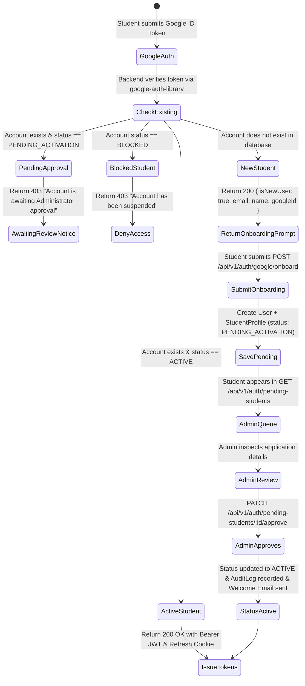

# Coaching Center Management System — Backend Production Blueprint & Plan

> **Version**: 2.6.0 (Enterprise Production Specification)  
> **Version**: 2.7.0 (Enterprise Production Specification)  
> **Architecture**: Single-Institution Coaching Center / Academy  
> **API Standard**: RESTful v1 with 93 Verified Endpoints across 14 Modules  
> **API Standard**: RESTful v1 with 88 Verified Endpoints across 14 Modules  
> **Status**: 100% Implemented, Verified & Quality Gate Passed
> **API Standard**: RESTful v1 across Core Operational Modules  
> **Status**: Verified & Quality Gate Passed

---

## 1. Project Mission & Domain Context

Build a secure, enterprise-grade backend for a **Coaching Center Management System (Academy)** governed by the system `ADMIN`. The platform centralizes and automates daily operational, academic, and financial workflows:
Build a secure, enterprise-grade backend for a **Coaching Center Management System (Academy)** governed by the system `ADMIN`. The platform centralizes and automates daily operational, academic, and administrative workflows:

- **Academy Governance**: Centralized single-institution profile, branding, and operational telemetry.
- **Identity & RBAC**: Strict role-based access control (`ADMIN`, `TEACHER`, `STUDENT`) with granular delegated operational permissions (`MANAGE_ATTENDANCE`, `MANAGE_EXAMS`, `MANAGE_ROUTINES`).
- **Academic Scheduling**: Batches, courses, seat capacity limits, and multi-dimensional conflict-free routine timetable scheduling.
- **Attendance Tracking**: Bulk daily marking for students and teachers with audit trails for corrections.
- **Examinations & Grading**: Exam scheduling, bulk marks entry with automated grading (`A+` to `F`), GPA calculation, and merit rankings.
- **Financial Ledger & Stripe Payments**: Real card payments via **Stripe Checkout Sessions & Webhooks**, front-desk multi-channel manual collection (Cash, bKash, Nagad, Bank Transfer), and immutable receipts (`REC-YYYY-XXXX`).
- **Document Generation & Dispatch**: Zero Cloud Storage in-memory PDF generation (`PDFKit`) for Invoices, Routines, and Report Cards streamed over HTTP or dispatched via email with attachments (`Nodemailer` + `EJS`).
- **Ledger-Backed Monthly Billing & Payments**: Real card payments via **Stripe Checkout Sessions & Webhooks**, front-desk multi-channel manual collection (Cash, bKash, Nagad, Bank Transfer) with partial payment support, auto-accumulated previous dues, and immutable receipts (`REC-YYYY-XXXX`).
- **Document Generation & Dispatch**: Zero Cloud Storage in-memory PDF generation (`PDFKit`) for Payment Receipts, Routines, and Report Cards streamed over HTTP or dispatched via email with attachments (`Nodemailer` + `EJS`).
- **Audit Logging**: Immutable tracking of financial transactions, permission grants, attendance corrections, and account status changes.
- **Document Generation & Dispatch**: Zero Cloud Storage in-memory PDF generation (`PDFKit`) for Routines and Report Cards streamed over HTTP or dispatched via email with attachments (`Nodemailer` + `EJS`).
- **Audit Logging**: Immutable tracking of administrative actions, permission grants, attendance corrections, and account status changes.

---

## 2. Core Architectural Pillars

1. **Strict Single-Institution Scoping**:
   - The entire system operates as a unified institution governed directly by the system `ADMIN`. All entities (students, teachers, batches, routines, attendance, exams, payments) belong directly to the academy without redundant multi-tenant foreign keys (`adminId`).
   - The entire system operates as a unified institution governed directly by the system `ADMIN`. All entities (students, teachers, batches, routines, attendance, exams) belong directly to the academy without redundant multi-tenant foreign keys (`adminId`).
2. **Unified Authentication vs. Role-Separated Registration**:
   - **Unified Login**: All users (`ADMIN`, `TEACHER`, `STUDENT`) authenticate via `POST /api/v1/auth/login`.
   - **Admin-Exclusive Provisioning**: Only the `ADMIN` has authority to directly register students (`POST /api/v1/auth/register-student`), register teachers (`POST /api/v1/auth/register-teacher`), and review/approve onboarding applicants (`GET /api/v1/auth/pending-students`, `PATCH /approve`, `PATCH /reject`).
   - **Student-Only Social Login**: Google Identity Services (GIS) login is strictly restricted to `Role.STUDENT`. Unregistered Google users pass through an onboarding gate (`POST /api/v1/auth/google/onboard`) into `PENDING_ACTIVATION` awaiting `ADMIN` approval.
3. **Mandatory Real Payment Integration (Stripe)**:
   - Real Stripe Checkout Sessions (`POST /api/v1/payments/create-checkout-session`) with server-side price calculation.
3. **Mandatory Real Payment Integration (Stripe & Multi-Channel Manual)**:
   - Real Stripe Checkout Sessions (`POST /api/v1/payments/create-checkout-session`) with server-side price calculation and zero-partial online payment constraint.
   - Front-desk manual collection with partial amount flexibility and multi-channel support (`CASH`, `BKASH`, `NAGAD`, `BANK_TRANSFER`).
   - Cryptographically verified raw-body Stripe webhook handler (`POST /api/v1/payments/webhook`) executing inside interactive Prisma transactions (`prisma.$transaction`).
   - Immutable financial transaction ledger and generated receipts (`REC-YYYY-XXXX`).
   - Ledger-backed monthly billing model (`MonthlyFeeBill`) with carried-over previous unpaid dues and immutable generated receipts (`REC-YYYY-XXXX`).
4. **Zero Cloud Storage In-Memory PDF Subsystem**:
   - Dynamic in-memory PDF generation via `PDFKit` (~15ms per document) for Payment Invoices, Weekly Timetables, and Student Report Cards.
5. **Zero Cloud Storage In-Memory PDF Subsystem**:
   - Dynamic in-memory PDF generation via `PDFKit` (~15ms per document) for Weekly Timetables and Student Report Cards.
   - Dynamic in-memory PDF generation via `PDFKit` (~15ms per document) for Payment Invoices/Receipts, Weekly Timetables, and Student Report Cards.
   - Streamed directly over HTTP (`inline` preview vs `attachment` download) or attached directly to Nodemailer emails, keeping Cloudinary storage exclusively for profile avatars.
6. **Universal QueryBuilder Standard**:
5. **Universal QueryBuilder Standard**:
   - Centralized `QueryBuilder` utility handling multi-field search (`?search=`), dynamic filtering (`?status=`, `?fee_gte=`, `?fee_lte=`), sorting (`?sortBy=`, `?sortOrder=`), and pagination (`?page=`, `?limit=`) across all 14 modules.
7. **Universal Soft Deletes & Audit Trails**:
8. **Universal QueryBuilder Standard**:
   - Centralized `QueryBuilder` utility handling multi-field search (`?search=`), dynamic filtering (`?status=`, `?fee_gte=`, `?fee_lte=`), sorting (`?sortBy=`, `?sortOrder=`), and pagination (`?page=`, `?limit=`) across all domain modules.
9. **Universal Soft Deletes & Audit Trails**:
6. **Universal Soft Deletes & Audit Trails**:
   - Deletions preserve data integrity via `deletedAt = new Date()`. All find queries filter out soft-deleted records. High-value mutations emit structured `AuditLog` records.

---

## 3. Technology Stack

| Category               | Technology                          | Purpose & Implementation Details                                                                                                                      |
| :--------------------- | :---------------------------------- | :---------------------------------------------------------------------------------------------------------------------------------------------------- |
| **Runtime & Language** | Node.js (v24+) + TypeScript (v7+)   | Server runtime with native ES modules and strict type safety (`moduleResolution: "bundler"`).                                                         |
| **Web Framework**      | Express.js (v5)                     | Modern HTTP pipeline, security middleware, and modular domain routing.                                                                                |
| **Database & ORM**     | PostgreSQL + Prisma (v7+)           | Relational database with driver adapter (`@prisma/adapter-pg` + `pg.Pool`) and modular multi-file schema folder (`prisma/*.prisma`).                  |
| **Validation**         | Zod (v4+)                           | Runtime schema validation and data sanitization for request body, query, params, and env.                                                             |
| **Authentication**     | Custom Credential Auth + Google GIS | Dual-token auth (15m JWT Access + 30d rotating HttpOnly Refresh Token RFC 6819) + Google OAuth 2.0 client token verification (`google-auth-library`). |
| **Payments**           | Stripe                              | Hosted checkout sessions, raw body signature verification, and automated webhook transaction fulfillment.                                             |
| **PDF Generation**     | PDFKit                              | Server-side in-memory programmatic PDF generation for receipts, routines, and grade sheets.                                                           |
| **Email & Templating** | Nodemailer + EJS                    | SMTP email dispatch with dynamic EJS HTML templates and PDF attachment streaming.                                                                     |
| **Media Storage**      | Cloudinary                          | Profile picture storage with AI face-gravity smart cropping ($500 \times 500$) behind `StorageService` abstraction.                                   |
| **Date & Time**        | date-fns (v4+)                      | Timezone-safe immutable date/time arithmetic and calendar formatting.                                                                                 |
| **Linter & Formatter** | Biome (v2.5+)                       | Enterprise linter, formatter, and import organizer (`biome.json`).                                                                                    |
| **Dev & Bundler**      | tsx + tsup                          | Hot reload dev server (`tsx watch`) and esbuild-based production bundler (`tsup`).                                                                    |
| **Documentation**      | Postman Collection (v2.1)           | Clean, self-contained API testing suite covering 93 endpoints (95 runnable requests) with baseUrl variable and cookie-based authentication.           |

---

## 4. Standard Module Architecture (Action-Based Service Decomposition)

Every domain feature module inside `src/modules/[feature]/` strictly follows a decomposed functional architecture:

```text
src/modules/[feature]/
├── [feature].interface.ts   # Domain interfaces, DTOs & hydrated model types
├── [feature].validation.ts  # Zod schemas for request body, query, and params
├── [feature].utils.ts       # Domain-specific helpers, formatters, and sanitizers
├── services/                # Action-decomposed business service functions
│   ├── [action1].service.ts # Single-responsibility pure service function
│   ├── [action2].service.ts # Single-responsibility pure service function
│   └── index.ts             # Services barrel aggregating and freezing service bundle
├── [feature].controller.ts  # Request extraction & response dispatching
├── [feature].routes.ts      # Express route definitions & middleware wiring
└── index.ts                 # Feature module barrel re-exporting all components
```

---

## 5. Google Authentication & Student Onboarding State Machine


```mermaid
stateDiagram-v2
    [*] --> GoogleAuth: Student submits Google ID Token
    GoogleAuth --> CheckExisting: Backend verifies token via google-auth-library

    CheckExisting --> ActiveStudent: Account exists & status == ACTIVE
    ActiveStudent --> IssueTokens: Return 200 OK with Bearer JWT & Refresh Cookie

    CheckExisting --> PendingApproval: Account exists & status == PENDING_ACTIVATION
    PendingApproval --> AwaitingReviewNotice: Return 403 "Account is awaiting Administrator approval"

    CheckExisting --> BlockedStudent: Account status == BLOCKED
    BlockedStudent --> DenyAccess: Return 403 "Account has been suspended"

    CheckExisting --> NewStudent: Account does not exist in database
    NewStudent --> ReturnOnboardingPrompt: Return 200 { isNewUser: true, email, name, googleId }

    ReturnOnboardingPrompt --> SubmitOnboarding: Student submits POST /api/v1/auth/google/onboard
    SubmitOnboarding --> SavePending: Create User + StudentProfile (status: PENDING_ACTIVATION)
    SavePending --> AdminQueue: Student appears in GET /api/v1/auth/pending-students

    AdminQueue --> AdminReview: Admin inspects application details
    AdminReview --> AdminApproves: PATCH /api/v1/auth/pending-students/:id/approve
    AdminApproves --> StatusActive: Status updated to ACTIVE & AuditLog recorded & Welcome Email sent
    StatusActive --> IssueTokens
```

---

## 6. Complete Master API Specification (91 Endpoints across 14 Modules)

### 6.1 Health Checks & System Telemetry (2 Endpoints)

- `GET /health` — Public basic liveness check.
- `GET /api/v1/health/detailed` — Detailed system health check (uptime, PostgreSQL status, memory usage).

### 6.2 Authentication & Session Lifecycle (7 Endpoints)

- `POST /api/v1/auth/login` — Unified login for all roles issuing access JWT and rotating HttpOnly refresh cookie.
- `POST /api/v1/auth/refresh-token` — Rotate refresh token and issue fresh access token (RFC 6819).
- `POST /api/v1/auth/logout` — Revoke active session and clear authentication cookies.
- `POST /api/v1/auth/logout-all` — Revoke all active login sessions across all devices.
- `GET /api/v1/auth/sessions` — List active login sessions with IP, user agent, and expiration info.
- `POST /api/v1/auth/forgot-password` — Request password reset link dispatched via email.
- `POST /api/v1/auth/reset-password` — Reset password using cryptographically verified reset token.

### 6.3 User Registration (Admin-Exclusive Authority) (2 Endpoints)

- `POST /api/v1/auth/register-student` — Admin directly registers student with academic profile (`classLevel`, `guardianName`, `guardianPhone`).
- `POST /api/v1/auth/register-teacher` — Admin directly registers teacher with subject profile and delegated permissions.

### 6.4 Google Social Login & Student Onboarding (2 Endpoints)

- `POST /api/v1/auth/google` — Google ID token GIS verification (Student only).
- `POST /api/v1/auth/google/onboard` — Public student onboarding submission creating account in `PENDING_ACTIVATION`.

### 6.5 Student Approval Workflow (Admin-Exclusive Authority) (3 Endpoints)

- `GET /api/v1/auth/pending-students` — List onboarding students awaiting administrative verification (`QueryBuilder`).
- `PATCH /api/v1/auth/pending-students/:id/approve` — Approve student (`ACTIVE`), emit audit log, and send activation email.
- `PATCH /api/v1/auth/pending-students/:id/reject` — Reject student application (`BLOCKED`).

### 6.6 Institution Governance & Branding (2 Endpoints)

- `GET /api/v1/institution` — Retrieve public academy profile, branding, address, and live operational stats.
- `PATCH /api/v1/institution` — Admin updates academy branding, contact, and address information.

### 6.7 User & Profile Management (8 Endpoints)

- `GET /api/v1/users/me` — Retrieve authenticated user profile, permissions, and session info.
- `PATCH /api/v1/users/me` — Update personal profile details (phone, name).
- `PATCH /api/v1/users/change-password` — Secure password change verifying old password credentials.
- `GET /api/v1/users` — Admin list users with pagination, search, and role filters (`QueryBuilder`).
- `GET /api/v1/users/:id` — Admin retrieve detailed user profile by ID.
- `PATCH /api/v1/users/teachers/:id/permissions` — Admin update and delegate teacher operational permissions.
- `PATCH /api/v1/users/:id/status` — Admin toggle user account status (`ACTIVE`, `INACTIVE`, `BLOCKED`).
- `DELETE /api/v1/users/:id` — Admin universal soft-delete user record (`deletedAt`).

### 6.8 Academic Batches & Enrollments (13 Endpoints)

- `POST /api/v1/batches` — Admin creates an academic batch with name, fee, and status.
- `GET /api/v1/batches` — List batches with pagination, search, and fee range filters (`QueryBuilder`).
- `GET /api/v1/batches/:id` — Retrieve batch details, timetable summary, and enrolled student count.
- `PATCH /api/v1/batches/:id` — Admin updates batch metadata or fee structure.
- `DELETE /api/v1/batches/:id` — Admin soft-deletes batch (`deletedAt`).
- `POST /api/v1/batches/:id/enroll` — Student self-enrollment request (`PENDING`).
- `GET /api/v1/batches/enrollments/pending` — Admin list pending enrollment applications (`QueryBuilder`).
- `PATCH /api/v1/batches/enrollments/:id/approve` — Admin approves student enrollment (`ENROLLED`).
- `PATCH /api/v1/batches/enrollments/:id/reject` — Admin rejects student enrollment (`REJECTED`).
- `POST /api/v1/batches/:id/students` — Admin direct student enrollment into batch.
- `GET /api/v1/batches/:id/students` — Admin & Teacher view batch student roster (`QueryBuilder`).
- `DELETE /api/v1/batches/:id/students/:userId` — Admin removes student from batch enrollment.
- `GET /api/v1/batches/my/enrolled` — Student views personal enrolled batch list.

### 6.9 Class Routines, Timetable Scheduling & Routine PDF (10 Endpoints)

- `POST /api/v1/routines` — Admin or authorized Teacher schedules a conflict-free routine slot.
- `GET /api/v1/routines` — List routine slots with filters (`QueryBuilder`).
- `GET /api/v1/routines/:id` — Retrieve single routine slot details.
- `GET /api/v1/routines/batch/:batchId` — Retrieve weekly batch timetable grouped by day of the week.
- `GET /api/v1/routines/teacher/:teacherId` — Retrieve teaching schedule for a specific teacher.
- `GET /api/v1/routines/my/teacher-schedule` — Teacher views personal weekly teaching schedule.
- `GET /api/v1/routines/my/student-schedule` — Student views personal weekly class timetable.
- `PATCH /api/v1/routines/:id` — Admin or authorized Teacher updates routine slot with conflict checks.
- `DELETE /api/v1/routines/:id` — Admin or authorized Teacher deletes routine slot.
- `GET /api/v1/routines/batches/:batchId/pdf` — **Download/Preview Batch Weekly Timetable PDF via PDFKit**.

### 6.10 Daily Student & Teacher Attendance Tracking (11 Endpoints)

- `POST /api/v1/attendance/batches/:batchId` — Record bulk student attendance for a batch.
- `GET /api/v1/attendance/batches/:batchId` — Retrieve batch attendance sheet filtered by date.
- `PATCH /api/v1/attendance/:id` — Correct single attendance record with audit trail.
- `GET /api/v1/attendance/students/:studentId` — Retrieve attendance history for a specific student.
- `GET /api/v1/attendance/my/summary` — Student views personal monthly attendance statistics & percentage.
- `POST /api/v1/attendance/teachers/check-in` — Teacher daily self check-in.
- `GET /api/v1/attendance/teachers/my/summary` — Teacher views personal attendance summary & percentage.
- `POST /api/v1/attendance/teachers/bulk` — Admin or authorized Teacher records bulk faculty attendance.
- `GET /api/v1/attendance/teachers` — Retrieve faculty attendance sheet filtered by date.
- `GET /api/v1/attendance/teachers/:teacherId/summary` — Retrieve attendance statistics for specific teacher.
- `PATCH /api/v1/attendance/teachers/:id` — Correct single teacher attendance record.

### 6.11 Exams, Marks, Results Pipeline & Report Card PDF (14 Endpoints)

- `POST /api/v1/exams` — Create exam assessment with total marks and pass marks.
- `GET /api/v1/exams` — List exams with filters (`QueryBuilder`).
- `GET /api/v1/exams/:id` — Retrieve exam assessment details by ID.
- `PATCH /api/v1/exams/:id` — Update exam assessment metadata.
- `DELETE /api/v1/exams/:id` — Admin deletes exam assessment and cascaded marks.
- `POST /api/v1/exams/:id/marks` — Bulk enter student marks with auto-grading & GPA calculation.
- `PATCH /api/v1/exams/:id/students/:studentId/mark` — Update mark for single student with audit log.
- `PATCH /api/v1/exams/:id/publish` — Publish exam results (`DRAFT` $\to$ `PUBLISHED`).
- `PATCH /api/v1/exams/:id/unpublish` — Unpublish exam results back to `DRAFT`.
- `GET /api/v1/exams/:id/results` — Retrieve batch merit list report with statistical aggregates.
- `GET /api/v1/exams/my/results` — Student views personal academic report cards summary.
- `GET /api/v1/exams/my/results/:id` — Student views single exam result.
- `GET /api/v1/exams/:id/students/:studentId/report-card/pdf` — **Download/Preview Student Grade Sheet Report Card PDF via PDFKit**.
- `POST /api/v1/exams/:id/students/:studentId/send-report-card` — **Dispatch Report Card PDF via Email to Student**.

### 6.12 Profile Picture & Media Storage (3 Endpoints)

- `PATCH /api/v1/users/me/avatar` — Upload personal avatar with AI face-crop ($500 \times 500$) to Cloudinary.
- `DELETE /api/v1/users/me/avatar` — Delete personal avatar from Cloudinary.
- `POST /api/v1/uploads/users/:id/avatar` — Admin uploads avatar for specific user by ID.

### 6.13 Monthly Fee Payments, Due Management, Webhooks & Receipt PDF (11 Endpoints)
### 6.13 Monthly Fee Payments, Ledger, Webhooks & Receipt PDF (8 Endpoints)

### 6.13 Centralized Audit Logging & Security Explorer (3 Endpoints)
- `GET /api/v1/payments/monthly-sheet` — Admin monthly billing sheet roster with student dues, carried-over debt, payments & statuses (`QueryBuilder`).
- `GET /api/v1/payments/stats` — Admin monthly payment dashboard metrics & statistics cards.
- `POST /api/v1/payments/manual-collect` — Admin collects offline fee (Cash, bKash, Nagad, Bank Transfer) with partial or full amount.
- `GET /api/v1/payments/my/bill` — Student views current month's fee bill + accumulated previous dues breakdown.
- `POST /api/v1/payments/create-checkout-session` — Student initiates Stripe Checkout Session for full monthly fee settlement.
- `POST /api/v1/payments/webhook` — Stripe raw body webhook listener fulfilling payments idempotently.
- `GET /api/v1/payments/transactions` — Admin system-wide payment transactions ledger (`QueryBuilder`).
- `GET /api/v1/payments/receipts/:billId/pdf` — **Download/Preview Payment Invoice Receipt PDF by Bill ID via PDFKit**.

- `POST /api/v1/payments/create-checkout-session` — Student creates Stripe Checkout Session for monthly tuition fee (`billingMonth`, `billingYear`).
- `POST /api/v1/payments/webhook` — Cryptographically verified Stripe webhook listener.
- `POST /api/v1/payments/manual-collect` — Admin collects offline monthly fee (Cash, bKash, Nagad, Bank) with billing period and notes.
- `PATCH /api/v1/payments/enrollments/:enrollmentId/previous-dues` — Admin adjusts historical start billing period & opening dues on student enrollment.
- `GET /api/v1/payments/my/dues` — Student calculates unpaid monthly fees and total outstanding dues across active batches.
- `GET /api/v1/payments/dues` — Admin monitors all students with outstanding dues & defaulters list.
- `GET /api/v1/payments/my` — Student views personal payment transactions and receipts.
- `GET /api/v1/payments` — Admin system-wide payment transaction ledger (`QueryBuilder`).
- `GET /api/v1/payments/stats` — Admin executive financial revenue dashboard & analytics.
- `GET /api/v1/payments/transactions/:transactionId/receipt` — Retrieve payment receipt metadata by Transaction ID.
- `GET /api/v1/payments/transactions/:transactionId/pdf` — **Download/Preview Payment Invoice Receipt PDF by Transaction ID**.

### 6.14 Centralized Audit Logging & Security Explorer (3 Endpoints)

- `GET /api/v1/audit-logs` — Admin system-wide audit log explorer (`QueryBuilder`).
- `GET /api/v1/audit-logs/stats` — Admin audit activity telemetry & operational action breakdown.
- `GET /api/v1/audit-logs/:id` — Admin retrieve single audit log record details by ID.

---

## 7. Standardized Response Envelope Format

### 7.1 Success Envelope

```json
{
  "success": true,
  "statusCode": 200,
  "message": "Batches retrieved successfully",
  "message": "Monthly fee sheet retrieved successfully",
  "meta": {
    "page": 1,
    "limit": 10,
    "total": 24,
    "totalPage": 3
  },
  "data": [
    {
      "id": "c1a2b3c4-...",
      "name": "HSC 2026 - Higher Mathematics",
      "fee": 3500.0,
      "status": "ONGOING"
      "studentName": "Tanvir Hasan",
      "batchName": "HSC 2026 - Higher Mathematics",
      "monthlyFee": 3500.0,
      "previousDue": 1500.0,
      "totalPayable": 5000.0,
      "paidAmount": 2000.0,
      "dueAmount": 3000.0,
      "status": "PARTIAL"
    }
  ]
}
```

### 7.2 Error Envelope

```json
{
  "success": false,
  "statusCode": 400,
  "message": "Validation failed on input parameters",
  "errors": [
    {
      "path": "email",
      "message": "Invalid email address format"
    }
  ]
}
```

---

## 8. Dual Database Seeder Architecture

1. **Server Startup Bootstrapper (`src/utils/seedData.ts`)**:
   - Automatically executed on `src/server.ts` startup.
   - Idempotently ensures root `ADMIN` account and `AdminProfile` exist from `.env` variables.
2. **Comprehensive Ecosystem Seeder (`prisma/seed.ts` via `npm run prisma:seed`)**:
   - Manually triggered developer/test seeder.
   - Bootstraps 3 Teachers with granular permissions, 3 Batches, weekly class routines, enrolled students, daily attendance records, published exams with grades, Stripe & manual payment receipts (`REC-2026-XXXX`), and immutable audit logs.
   - Bootstraps 3 Teachers with granular permissions, 3 Batches, weekly class routines, enrolled students, daily attendance records, published exams with grades, and immutable audit logs.
   - Bootstraps 3 Teachers with granular permissions, 3 Batches, weekly class routines, enrolled students, daily attendance records, published exams with grades, Monthly Fee Bills with partial & full Stripe and offline payment transactions (`REC-2026-XXXX`), and immutable audit logs.

---

## 9. Final Verification & Quality Gates Status

| Quality Gate                   | Requirement                           | Actual Status                                              |
| :----------------------------- | :------------------------------------ | :--------------------------------------------------------- |
| **Biome Linter & Formatter**   | 0 errors, 0 warnings across all files | **PASSED (182 files checked, 0 errors)**                   |
| **TypeScript Strict Compiler** | 0 type errors (`tsc --noEmit`)        | **PASSED (0 errors)**                                      |
| **Production Bundler**         | Successful compilation via `tsup`     | **PASSED (`dist/server.js` compiled, 292.21 KB)**          |
| **Production Bundler**         | Successful compilation via `tsup`     | **PASSED (`dist/server.js` compiled)**                     |
| **Prisma 7 Ecosystem Seeder**  | Idempotent complete seed              | **PASSED (10/10 stages completed)**                        |
| **PDF Generators**             | Dynamic in-memory PDF buffers         | **PASSED (Receipt, Routine & Report Card verified)**       |
| **Postman Test Suite**         | 93 endpoints (95 runnable requests)   | **PASSED (Clean Collection v2.1 synced with cookie auth)** |
| **Prisma 7 Ecosystem Seeder**  | Idempotent complete seed              | **PASSED (9/9 stages completed)**                          |
| **PDF Generators**             | Dynamic in-memory PDF buffers         | **PASSED (Routine & Report Card verified)**                |
| **Postman Test Suite**         | 82 endpoints (84 runnable requests)   | **PASSED (Clean Collection v2.1 synced with cookie auth)** |
| **Postman Test Suite**         | 88 endpoints (90 runnable requests)   | **PASSED (Clean Collection v2.1 synced with cookie auth)** |
