# Coaching Center Management System — Backend API

> An enterprise-grade, multi-branch **Coaching Center Management System** backend designed for coaching institutions. Built with Node.js (v24+), TypeScript (v7+), Express.js (v5), and Prisma ORM (v7+) with PostgreSQL.

---

## 1. Entity Relationship Diagram (ERD)

The diagram below represents the complete relational database architecture across all domain modules:

```mermaid
erDiagram
    %% Core Identity & Profiles
    User ||--o| AdminProfile : "has (ADMIN)"
    User ||--o| StudentProfile : "has (STUDENT)"
    User ||--o| TeacherProfile : "has (TEACHER)"
    User ||--o{ TeacherPermission : "delegated"
    User ||--o{ Session : "authenticates"
    User ||--o{ AuditLog : "emits"

    %% Branch & User Hierarchy (Admin = Branch)
    User ||--o{ User : "manages (adminId -> User)"
    User ||--o{ Batch : "operates (adminId)"
    User ||--o{ ClassRoutine : "teaches (teacherId)"

    %% Academic & Scheduling
    Batch ||--o{ ClassRoutine : "schedules (weekly slots)"
    Batch ||--o{ Enrollment : "contains"
    Batch ||--o{ AttendanceRecord : "tracks"
    Batch ||--o{ Exam : "schedules"
    Batch ||--o{ PaymentTransaction : "receives"

    %% Student Participation
    User ||--o{ Enrollment : "enrolls (studentId)"
    User ||--o{ AttendanceRecord : "records (studentId or markedById)"
    User ||--o{ ExamResult : "receives marks"
    User ||--o{ PaymentTransaction : "pays (studentId)"

    %% Exams & Performance
    Exam ||--o{ ExamResult : "evaluates"

    %% Payments & Invoicing
    Enrollment ||--o{ PaymentTransaction : "pays for (optional)"
    PaymentTransaction ||--o| Receipt : "issues"

    %% Entity Field Definitions
    User {
        string id PK "UUID"
        string email UK
        string password "Nullable (null for Google OAuth)"
        string name
        string phone UK
        string avatarUrl "Nullable"
        Role role "SUPER_ADMIN | ADMIN | TEACHER | STUDENT"
        UserStatus status "ACTIVE | INACTIVE | BLOCKED | PENDING_ACTIVATION"
        string googleId UK "Nullable"
        string adminId FK "Nullable (Branch Admin reference)"
        datetime createdAt
        datetime updatedAt
        datetime deletedAt "Nullable (Soft delete)"
    }

    AdminProfile {
        string id PK "UUID"
        string userId FK, UK
        string branchName "e.g. Dhanmondi Campus"
        string branchAddress
        string branchPhone "Nullable"
        datetime createdAt
        datetime updatedAt
    }

    StudentProfile {
        string id PK "UUID"
        string userId FK, UK
        string guardianName
        string guardianPhone
        string institutionName "Nullable"
        string classLevel "e.g. Class 10, HSC-1st"
        string rollNumber "Nullable"
        datetime createdAt
        datetime updatedAt
    }

    TeacherProfile {
        string id PK "UUID"
        string userId FK, UK
        string designation "e.g. Senior Lecturer"
        string qualification
        string specialization
        datetime joiningDate "Nullable"
        datetime createdAt
        datetime updatedAt
    }

    TeacherPermission {
        string id PK "UUID"
        string teacherId FK
        Permission permission "MANAGE_STUDENTS | MANAGE_ATTENDANCE | MANAGE_EXAMS | MANAGE_ROUTINES | VIEW_REPORTS"
        datetime createdAt
    }

    Session {
        string id PK "UUID"
        string userId FK
        string refreshTokenHash
        string ipAddress "Nullable"
        string userAgent "Nullable"
        datetime expiresAt
        datetime revokedAt "Nullable"
        datetime createdAt
    }

    Batch {
        string id PK "UUID"
        string adminId FK "Branch Admin reference"
        string name "e.g. Class 9 - Morning"
        decimal fee "10,2"
        BatchStatus status "UPCOMING | ONGOING | COMPLETED | CANCELLED"
        datetime createdAt
        datetime updatedAt
        datetime deletedAt "Nullable (Soft delete)"
    }

    ClassRoutine {
        string id PK "UUID"
        string batchId FK
        DayOfWeek dayOfWeek "SATURDAY | SUNDAY | MONDAY | TUESDAY | WEDNESDAY | THURSDAY | FRIDAY"
        string startTime "HH:mm format (e.g. 10:00)"
        string endTime "HH:mm format (e.g. 11:30)"
        string subject "Nullable (e.g. Higher Math)"
        string room "Nullable (e.g. Room 101)"
        string teacherId FK "Nullable"
        datetime createdAt
        datetime updatedAt
    }

    Enrollment {
        string id PK "UUID"
        string studentId FK
        string batchId FK
        EnrollmentStatus status "PENDING | ENROLLED | REJECTED"
        datetime enrolledAt
        datetime approvedAt "Nullable (Admin approval timestamp)"
        datetime createdAt
        datetime updatedAt
    }

    AttendanceRecord {
        string id PK "UUID"
        string batchId FK
        string studentId FK
        string markedById FK
        date date "Native PostgreSQL DATE"
        AttendanceStatus status "PRESENT | ABSENT | LATE | EXCUSED | LEAVE"
        string remarks "Nullable"
        datetime createdAt
        datetime updatedAt
    }

    Exam {
        string id PK "UUID"
        string batchId FK
        string title "e.g. Weekly Test 1: Algebra"
        string description "Nullable"
        decimal totalMarks "5,2"
        decimal passMarks "5,2"
        date examDate "Native PostgreSQL DATE"
        ExamStatus status "UPCOMING | ONGOING | COMPLETED | CANCELLED"
        ResultStatus resultStatus "DRAFT | PUBLISHED"
        datetime createdAt
        datetime updatedAt
    }

    ExamResult {
        string id PK "UUID"
        string examId FK
        string studentId FK
        decimal marksObtained "5,2"
        string grade "Nullable (e.g. A+, A, B, F)"
        string remarks "Nullable"
        datetime createdAt
        datetime updatedAt
    }

    PaymentTransaction {
        string id PK "UUID"
        string studentId FK
        string batchId FK
        string enrollmentId FK "Nullable"
        decimal amount "10,2"
        string currency "bdt"
        PaymentMethod paymentMethod "STRIPE | CASH | BKASH | BANK_TRANSFER | NAGAD"
        PaymentStatus status "PENDING | COMPLETED | FAILED | REFUNDED"
        string stripeSessionId UK "Nullable"
        string stripePaymentIntentId "Nullable"
        datetime paidAt "Nullable"
        datetime createdAt
        datetime updatedAt
    }

    Receipt {
        string id PK "UUID"
        string transactionId FK, UK
        string receiptNumber UK "e.g. REC-2026-0001"
        datetime issuedAt
        string downloadUrl "Nullable (PDFKit generated)"
        datetime createdAt
        datetime updatedAt
    }

    AuditLog {
        string id PK "UUID"
        string userId FK "Nullable"
        string action "e.g. PAYMENT_COMPLETED, USER_BLOCKED"
        string entity "e.g. User, Batch, Payment"
        string entityId
        string details "Nullable (JSON metadata string)"
        string ipAddress "Nullable"
        string userAgent "Nullable"
        datetime createdAt
    }
```



---

### System Enums

| Enum | Values | Description |
| :--- | :--- | :--- |
| **`Role`** | `SUPER_ADMIN`, `ADMIN`, `TEACHER`, `STUDENT` | System-wide role-based access control. |
| **`UserStatus`** | `ACTIVE`, `INACTIVE`, `BLOCKED`, `PENDING_ACTIVATION` | Account state (e.g. Google-onboarded starts as `PENDING_ACTIVATION`). |
| **`DayOfWeek`** | `SATURDAY`, `SUNDAY`, `MONDAY`, `TUESDAY`, `WEDNESDAY`, `THURSDAY`, `FRIDAY` | 7-day calendar days for `ClassRoutine` weekly timetable. |
| **`BatchStatus`** | `UPCOMING`, `ONGOING`, `COMPLETED`, `CANCELLED` | Lifecycle of a coaching class batch. |
| **`EnrollmentStatus`** | `PENDING`, `ENROLLED`, `REJECTED` | Student batch admission approval workflow. |
| **`AttendanceStatus`** | `PRESENT`, `ABSENT`, `LATE`, `EXCUSED`, `LEAVE` | Daily student attendance categories. |
| **`ExamStatus`** | `UPCOMING`, `ONGOING`, `COMPLETED`, `CANCELLED` | Batch exam timeline status. |
| **`ResultStatus`** | `DRAFT`, `PUBLISHED` | Exam marks publication gate (only published marks are visible to students). |
| **`PaymentMethod`** | `STRIPE`, `CASH`, `BKASH`, `BANK_TRANSFER`, `NAGAD` | Online and offline payment collection channels. |
| **`PaymentStatus`** | `PENDING`, `COMPLETED`, `FAILED`, `REFUNDED` | Transaction payment verification status. |
| **`Permission`** | `MANAGE_STUDENTS`, `MANAGE_ATTENDANCE`, `MANAGE_EXAMS`, `MANAGE_ROUTINES`, `VIEW_REPORTS` | Delegated operational permissions for teachers. |
| **`Gender`** | `MALE`, `FEMALE`, `OTHER` | Standard gender demographic options. |


---

## 2. Core Architecture Highlights

1. **Admin = Branch Isolation**:
   - Super Admin governs the whole organization.
   - Each Admin user represents and operates an independent campus/branch (`AdminProfile` stores branch name, address, and phone).
   - Students and Teachers are linked to their branch via `adminId`. All database queries are strictly isolated per branch.
2. **Weekly Timetable Scheduling (`ClassRoutine`)**:
   - Batch class times are broken down into structured weekly timetable slots (`dayOfWeek`, `startTime`, `endTime`, `subject`, `room`, `teacherId`).
   - Powers interactive calendar and timetable UIs on the frontend with conflict detection.
3. **Streamlined Student Enrollment**:
   - Decoupled from user account state.
   - `PENDING` -> student requests batch enrollment.
   - `ENROLLED` -> Admin verifies/approves enrollment or payment is confirmed.
4. **Calendar-Safe Attendance (`AttendanceRecord`)**:
   - Uses PostgreSQL native `@db.Date` to avoid timezone drift.
   - Idempotent unique constraint `@@unique([batchId, studentId, date])`.
5. **Draft / Published Result Pipeline (`Exam` & `ExamResult`)**:
   - Marks remain in `DRAFT` while teachers enter scores.
   - Flipping to `PUBLISHED` exposes report cards and grades to students and guardians.
6. **Stripe & Multi-Channel Fee Collection (`PaymentTransaction` & `Receipt`)**:
   - Supports Stripe Checkout Sessions, webhooks, and manual cash receipts.
   - Generates immutable PDF payment receipts via `pdfkit`.

---

## 3. Technology Stack

| Technology                            | Purpose                                                                   |
| :------------------------------------ | :------------------------------------------------------------------------ |
| **Node.js (v24+) + TypeScript (v7+)** | Native ES modules (`bundler` mode) with strict type safety                |
| **Express.js (v5)**                   | High-performance HTTP server & middleware pipeline                        |
| **PostgreSQL + Prisma ORM (v7+)**     | Driver adapter (`@prisma/adapter-pg` + `pg.Pool`) & modular schema folder |
| **Zod (v4+)**                         | Strict runtime schema validation for inputs and env variables             |
| **Stripe**                            | Online card checkout sessions and webhook verification                    |
| **Google Auth Library**               | Google Identity Services token verification for student login             |
| **Biome (v2.5+)**                     | Ultra-fast linter, formatter, and import organizer                        |
| **date-fns (v4+)**                    | Timezone-safe date arithmetic and routine calendar formatting             |
| **Nodemailer + EJS**                  | Transactional email dispatching with dynamic HTML templates               |
| **PDFKit**                            | Server-side programmatic PDF generation for printable receipts & routines |

---

## 4. Development & Scripts

```bash
# Install dependencies
pnpm install

# Run development server with hot-reload
pnpm dev

# Generate Prisma client
pnpm prisma:generate

# Run linter and formatter check
pnpm check

# Auto-fix formatting and imports
pnpm check:fix

# Run TypeScript typecheck
pnpm typecheck

# Production build
pnpm build
```
